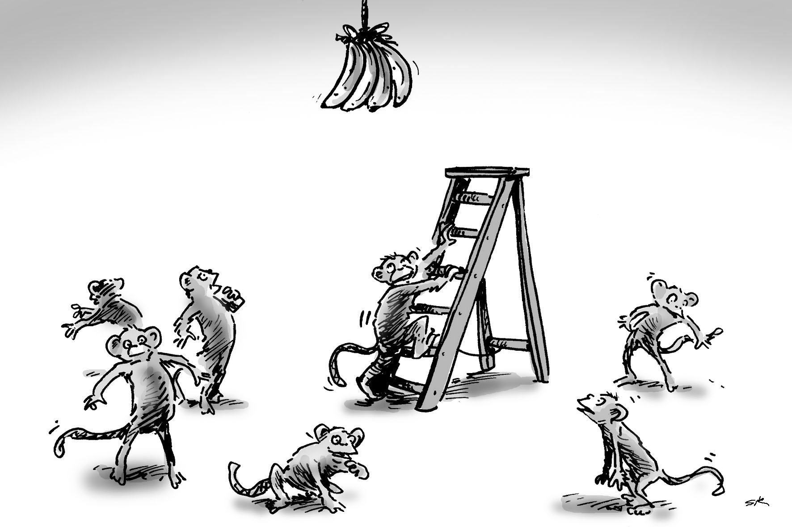

title: DevOps-ing the hard way: a non recipe.
class: animation-fade, responsive, middle, center
layout: true

---
class: impact

#DevOps-ing the Hard Way.

##A non recipe.

???

That presentation is:

* Not a off-the-shelf solution for DevOps
* Not a demonstration of a powerful DevOps tool
* Some feedback about my 3 years DevOps experience
* My humble opinion on what DevOps is supposed to be
* Advices on how to get started while working with different kind of people
* A reminder that DevOps is a human transformation before everything.

---

.col-3[.responsive[]]
.col-9[
#Antoine Neveux
###Software Engineer @ Worldline
.twitter[][@antoineneveux](https://twitter.com/antoineneveux)]

???

Don't hesitate to contact me through Twitter if you'd like to discuss or ask questions :)
I'd be really happy to know if anyone actually ever looks at those slides :p

---
layout: true
class: animation-fade, responsive, middle, center, border1
---

.gif[]

---

.gif[]

???

* That presentation contains a bit of sarcasm
* No offense ;) Just exagerating a bit on some contexts to deliver easily my message ;)

---

.gif[]

???

* All contexts, teams and projects are different... So I clearly don't pretend I know everything
* By the way, nobody should ;)

---

.gif[]

???

* My humble opinion: there is no truth about DevOps anyway...
* Except maybe the fact that it won't be the same for all the teams ;)

---

.gif[]

???

* I'm just sharing my thoughts and some feedback...
* If it helps at least one person, I'll be happy :p

---

.gif[]

???

* After working hard during 3/4 years, we managed a DevOps transition in our team!
* It didn't go without failing... We actually failed a lot!
* But in the end: we delivered our projects, and we became so much more efficient!
* One metric? We went from 1 month to 1 hour for delivering our platform!

---

.responsive[]

???

* First big topic for us: we migrated our whole platform to a vmware infrastructure...
* And we rewrote from scratch our provisioning mechanism!
* Kinda Ops topic in which Devs participated!

---

.responsive[]

???

* Then we rewrote from scratch the whole middleware of application!
* Yes we love rewritting stuff!
* This time, kinda Devs topic in which Ops participated!

---
class: impact

#Before talking about DevOps...

---
layout: true
class: animation-fade, responsive, middle, center, border2
---

.gif[]

???

* Just a bit of context: I think the *DevOps* word is overused a lot...
* But here again it's a buzzword... So it's not that surprising...
* I just want to say that in most situations, you're not doing DevOps... Just IT in not so good situations ;)

---

.gif[]

???

#You are working with a team

* If you're by yourself, there's no DevOps to reach... Just loneliness to fight ;)
---

.gif[]

???

#Your service actually has users

* No users = your main target is to get users... Otherwise you're just wasting time ;)

---

.gif[]

???

#BTW, you actually have a service...

* If your service isn't in production yet, there's no DevOps!
* You're just using big words to describe your development environment...

---

.gif[]

???

#And your service is used...

* If nobody cares when your service is down... That probably means that nobody cares about your service at all...
* Then DevOps isn't a target to reach: finding proper users is your main concern.

---

.gif[]

???

* If you match everything: DevOps could be a target!
* Otherwise, you probably have other concerns ;)

---
class: impact, noborder

#DevOps: A Human Transformation.

---
layout: true
class: animation-fade, responsive, middle, center, border3
---

#Dev &amp; Ops are different.

##Don't be afraid to say it.

???

* Big concern nowadays: people are afraid to admit that devs and ops are different...
* Go ahead, say it! Because they actually are!

---

#Our biggest mistakes:

---

###DevOps = 50% Dev, 50% Ops!

---

###DevOps = 100% Generalists, 0% Specialists!

---

###DevOps = Devs adapting to Ops!

---

###DevOps = Ops adapting to Devs!

---

###DevOps = Must have! To be enforced in all teams!

---

.gif[]

---

#Back to the Basics.

---
class: impact, noborder

#Developers?

---

.responsive[]

???

* Remember I talked about sarcasm?
* From an Ops perspective... Devs are just capricious kids.
* They want the latest version of everything, without waiting, without caring about consequences...
* Yet, developers are:

---

###Creative

---

###Perfectionist

---

###Curious

---

###Lazy

---

###Fond of new things

---

###Led by fashion

---

#Form > Substance

???

* That trap could happen if you're not taking care ;)
* But yet again:

---

#Developers can find solutions you wouldn't imagine to a problem you face.

---

#Developers will challenge you towards immutable infrastructure!

---

#Developers will want to automate the tests of your infrastructure provisioning!

---
class: impact, noborder

#Ops?

---

.responsive[]

???

* Look at those Ops having fun!
* From a Dev perspective, Ops people are just sad people yelling at everybody not following their orders...
* They're not taking risks, they're obedient without understanding...
* But yet again, Ops people are:

---

###Pragmatic

---

###Realistic

---

###Responsible

---

###Experienced

---

###Fond of stable things

---

###Led by efficiency

---

#Substance > Form

???

* Again a trap Ops people could fall into...
* But also:

---

#Ops can ask questions about issues you wouldn't imagine you may face.

---

#Ops will teach you how to scale your application!

---

#Ops will teach you how to increase performances!

---
class: impact, noborder

#Devs &amp; Ops have different mindsets.

.big[Deal with it.]

???

* That's fine: you'll get the benefits of complementarity!

---

.gif[]

---

#Want to start DevOps-ing?

---

###Discover your team mates!

---

###Listen to each others!

---

###Start working on complementary topics!

--

_Topics where you can both teach and learn something!_

---

.gif[]

---
layout: true
class: animation-fade, responsive, middle, center, border4
---

.gif[]

???

* You need to build things together!
* If you don't have the same target, you won't do things together.

---

.gif[]

???

#Workshops &amp; Presentations

* That is a must have starting point!
* People should know each others!
* What they like/dislike/want to do/don't want to do/think about their job/think about others job...
* Take the required time...
* In our case, we took 3 days to just discuss with our 8 people team!

---

.gif[]

???

#Retrospective Meetings!

* Share your real problems.
* I'm talking about real retrospectives, with a nice animation!
* Where people are searching for actions and solutions to enhance the global situation!
* Not a place where people just yell at each others.
* We're doing one on a monthly basis in my team.

---

#Good starting point?

### Ask people about their main issue and how they'd fix it!

_It's rarely just a tool, they'd be using it already..._

---

.gif[]

???

* Make sure you're reaching realistic plans...
* Deciding things you won't even be able to reach isn't so motivating...

---

.gif[]

???

#Pair Working!

* Done in a right way, it's just crazy how fast you can learn stuff!
* In our case, we did so much Devs + Ops pair working!

---

.gif[]

???

#Repeat it!

* Workshops shouldn't be a one time meeting...
* Otherwise they're easily forgotten!
* In our team, we have a 2h Ops workshop per week,
* And a 2h Dev workshop per week,
* Which means a workshop dedicated to Ops tasks, and one dedicated to Dev tasks,
* But everybody participates!
* With some time we saw some nice situations where Devs lead the Ops workshops and the other way around!

---

.gif[]

???

#Collaborative Architecture Decisions

* Involve people in decisions so they'll be involved in the project!
* Even their crazy questions/ideas can bring a lot to your decisions!

---

.gif[]

???

#Be kind!

* A huge cliché but Oh God is that necessary!

---

.gif[]

???

#Trust each others

* Stop thinking Devs or Ops are dumb or don't know what they're doing!
* They are professional and probably are doing things in a proper way...
* Maybe they lack some information which led to them not taking the correct decisions...
* Or maybe you lack some information and you don't undertand why they're doing things in a certain way!

---

.gif[]

???

#Ask Questions

* Just question everything!

---
class: impact, noborder

#Methodologies &amp; Organization?

---

#Using SCRUM was kind of a failure...

.big[It didn't fit very well...]

???

* Forcing SCRUM is probably a really bad idea!
* Run activities are not predictable by nature...
* You'll lose time estimating, and then feel bad of failing your sprints!

---

#So we tried Kanban...

???

* We did that and we're still using it.

---

#And even having 2 lifecycles!

###Predictable VS. Unpredictable.

???

* Care about the *predictable* and *unpredictable*.
* It's not Devs vs Ops.

---

#Actually the main problem was to keep having a balanced backlog.

???

* New features, bugfixes, technical debt...
* A bit of everything!

---

#Think Product. Not Project.

???

* You have one goal: your users must be happy.
* Everyone in the team get this same goal.

---
class: impact, noborder

#Mandatory for DevOps: CI!

???

* Aha! Mandatory CI isn't for Continuous Integration!
* You'll probably come to Continuous Integration at some point.
* But remember that automating silly things is just letting mistakes and errors propagate faster ;)

---

#CI = Continuous Improvement!

???

* You won't find the best solution on your first try!
* You'll actually probably even never find it ;)
* So keep trying!

---

#Iterate and try out things!

???

* It's important to allow yourself to fail!
* Which is an easy to understand statement as a Dev...
* But not so easy as an Ops!

---

#Remember about the non recipe ;)

---
class: impact, noborder

#What about tools?

---
layout: true
class: animation-fade, responsive, middle, center, border5
---

## Human >> Process >> Tool

???

* If you start from the right side, you'll never reach the left side!
* People should understand the situation, then find a process to deal with it, and finally maybe automate things to overcome the problem.
* At that moment, and only at that moment, they'll understand what they're doing ;)

---

.responsive[]

???

* See [that video](https://www.youtube.com/watch?v=y-PvBo75PDo) for reference
* That is what could happen in a team if people are using things they don't understand...

---

#Automation can be a silver bullet!

--

###If you know where to aim at!

???

* Cause a silver bullet in your foot remains kinda hurtful.

---

#The team needs to express the problem, and find the proper solution.

---

#For a DevOps transition, coaching is better than guidance.

---

.gif[]

???

* Please no off-the-shelf solutions!
* They'll most likely be out of context
* The team needs to find what is a solution for them!

---

.gif[]

---
layout: true
class: animation-fade, responsive, middle, center, noborder
---

#DevOps isn't:

###A silver bullet, tools, processes, job profiles, the solution to everything.

---

#DevOps is: a human transformation within a team.

---

#It is a great adventure, with potential great results!

---

.gif[]

---

#Claiming you're doing DevOps because you use Docker or Continuous Integration...
#Is just like claiming you're doing Agile because you have daily meetings.

---

.gif[]

---
class: impact

#Questions?
